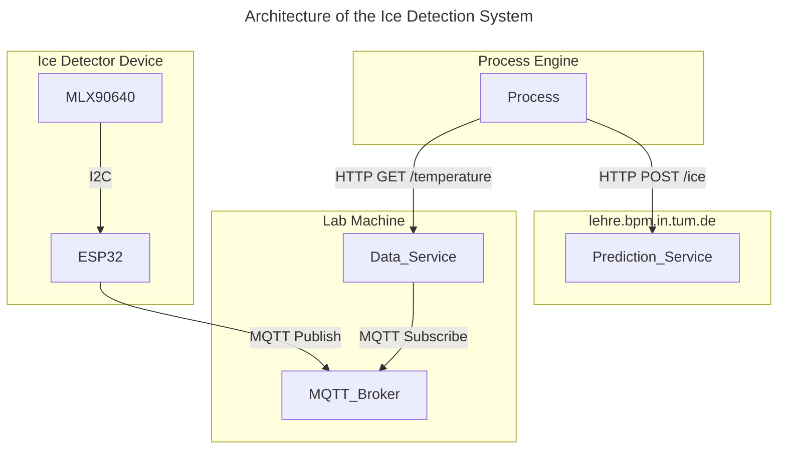

# Ice Detection System using MLX90640

This project implements an ice detection system using the **MLX90640 thermal sensor** and **ESP32 microcontroller** inside a 3D printed enclosure as a "thermal camera" (Ice Detector Device). The Ice Detector Device communicates via MQTT to transfer raw thermal data to an HTTP service (Data Service) which exposes the data for further use. Another HTTP service (Prediction Service) is used to detect if or how much ice is present from the thermal data. A complete ice detection process is implemented using the [Cloud Process Execution Engine](https://cpee.org) and can be found [here](https://cpee.org/hub/server/Teaching.dir/Prak.dir/TUM-Prak-24-SS.dir/IceDetectorDetection.xml).

Details about the setup and usage of each part of the system can be found in the respective READMEs:
- [Ice Detector Device README](https://github.com/jannemannX/master-praktikum-SoSe24/blob/main/ice-detector/README.md)
- [Data Service README](https://github.com/jannemannX/master-praktikum-SoSe24/blob/main/data-service/README.md)
- [Prediction Service README](https://github.com/jannemannX/master-praktikum-SoSe24/blob/main/prediction-service/README.md)

TODO add picture of thermal reading with photo of camera side by side to immediately see what this is about

## Architecture

We had to build an architecture that allows the CPEE to interact with the Ice Detector Device in a straightforward way, while maintaining a modular design that allows for easy extension and modification of the system. The following diagram illustrates the architecture of the Ice Detection System:

### Ice Detector Device
The Ice Detector Device is a custom-built thermal camera using an MLX90640 thermal array and ESP32 microcontroller. It captures thermal data at 4Hz using a chess pattern sampling mode for better accuracy and stability. The device publishes both ambient temperature and a 24x32 temperature grid via MQTT, which allows for real-time updates. The complete device is housed in a custom 3D-printed enclosure designed for easy assembly and maintenance. For detailed setup and usage instructions, see the [Ice Detector Device README](https://github.com/jannemannX/master-praktikum-SoSe24/blob/main/ice-detector/README.md).

### Data Service
The Data Service acts as a bridge between the MQTT-based sensor data and HTTP clients. It subscribes to the MQTT topics where the Ice Detector Device publishes its readings and maintains the latest temperature data in memory. Through its REST API, it provides access to both the current ambient temperature and the complete temperature grid. The service includes a web-based dashboard for real-time monitoring of the thermal data. See the [Data Service README](https://github.com/jannemannX/master-praktikum-SoSe24/blob/main/data-service/README.md) for setup and API details.

### Prediction Service
The Prediction Service implements the ice detection logic by analyzing the thermal data. It accepts temperature grid data via HTTP POST requests and uses configurable thresholds to determine both the presence of ice and the percentage of the captured area that appears to be frozen. The service is designed to be simple, but effective, using temperature differences rather than absolute values for more reliable detection across varying ambient conditions. For API specifications and deployment instructions, refer to the [Prediction Service README](https://github.com/jannemannX/master-praktikum-SoSe24/blob/main/prediction-service/README.md).

## Process
The goal was to find a fun, modular and reusable way to detect if there was any or enough ice dispensed during the existing cocktail mixing process, to then use it to handle these cases. For demonstration purposes we implemented a process that utilizes both the data service as well as the prediction service to add error detection and handling to the already existing ice dispension process.

TODO link the process (and subprocesses)

TODO insert a screenshot of the process

TODO insert GIF of working process

## Challenges
Some of the challenges we faced during the project are described below.

### Infrared distortion and noise
Glass and especially plexiglass distort the infrared signal. This was a problem since we wanted to detect ice inside a plexiglass cup. The detection still works reliably as the temperature difference between ice and ambient is large enough. To further stabilize detection results however, we implemented a smoothing of the thermal data and used Chess Mode for the sensor, too avoid false positives caused by noisy readings.

### 3D printing of enclosure
The 3D modelling and printing was very challenging as there was no prior experience present with any of this. After countless iterations and a lot of help from the internet, we finally managed to print a working enclosure for the device, that holds together via a snap-fit mechanism and doesnt rely on screws or glue and therefore can be easily assembled and disassembled. In the process we learned a lot about 3D modelling and printing and are now the proud owner of a BambuLab A1 Mini.

### MQTT Publish size limit
To reliably transmit the thermal data from the ESP32 to the Data Service, we had to split the data by the rows of the sensor and send them in multiple messages. This was necessary because the data was too large for the ESP32 to send in one message without significantly more complex communication, memory management and error handling. By publishing the data into multiple topics, we were able to keep the communication and the code simple and reliable.

## Future Work

### Ice Detection Algorithm
The current ice detection algorithm is based on a simple thresholding of the temperature data. Future work could include the implementation of a more sophisticated algorithm that takes into account the spatial distribution of the temperature data and the distance and size of the glass. This could be achieved by using machine learning techniques to train a model on a dataset of thermal images with and without ice. This was unnecessary for the current project, as the ice detection was already working reliably with the simple thresholding, but might be necessary for more complex use cases.

### Limiting thermal noise
Further research could be put into how to optimally shield the sensor from thermal noise. This could include modifying the enclosure to better shield the sensor from ambient temperature changes or by implementing a more sophisticated noise reduction algorithm in the software. Even with the noise we could reliably detect ice, but the system could be made more robust and less prone to fluctuation by reducing the noise.

### Integration with other systems
As we build our system in a modular way, it is easy to integrate it with other systems. For example, it could be used to detect humans in an area without the them needing to move regularly as with a PIR sensor. The thermal camera could also be used to detect overheating in electrical systems or to detect the presence of a specific object in a room. The possibilities are countless, but applications needing more fine grained temperature data or a higher resolution would require a different (and more expensive) sensor.

## Conclusion
While the solution of building a DIY thermal camera for the task at hand might seem completly overengineered at first, it was a challengin, fun and educational project that allowed us to learn a lot about processes and process engines in a real-world scenario, thermal imaging, working with a robot arm, REST APIs, microcontroller, 3D printing and much more. The system we built is modular and can be easily extended or modified to fit other use cases. The ice detection process we implemented is simple but effective and could be used in a variety of applications. We are proud with the results achieved and are curious to see which other use cases the thermal camera might have in the future. If you have any questions or need help feel free to reach out at [jan.wesseling@tum.de](mailto:jan.wesseling@tum.de)!