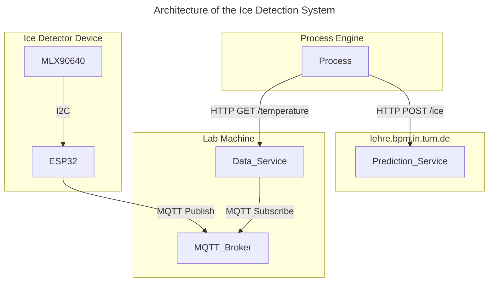

# Ice Detection System using MLX90640

This project implements an ice detection system using the **MLX90640 thermal sensor** and **ESP32 microcontroller** inside a 3D printed enclosure as a "thermal camera" (Ice Detector Device). The Ice Detector Device communicates via MQTT to transfer raw thermal data to an HTTP service (Data Service) which exposes the data for further use. Another HTTP service (Prediction Service) is used to detect if or how much ice is present from the thermal data. A complete ice detection process is implemented using the [Cloud Process Execution Engine](https://cpee.org) and can be found [here](https://cpee.org/hub/server/Teaching.dir/Prak.dir/TUM-Prak-24-SS.dir/IceDetectorDetection.xml).

Details about the setup and usage of each part of the system can be found in the respective READMEs:
- [Ice Detector Device](https://github.com/jannemannX/master-praktikum-SoSe24/blob/main/ice-detector/README.md)
- [Data Service](https://github.com/jannemannX/master-praktikum-SoSe24/blob/main/data-service/README.md)
- [Prediction Service](https://github.com/jannemannX/master-praktikum-SoSe24/blob/main/data-service/README.md)

TODO add picture of thermal reading with photo of camera side by side to immediately see what this is about

## Architecture

We had to build an architecture that allows the CPEE to interact with the Ice Detector Device in a straightforward way, while maintaining a modular design that allows for easy extension and modification of the system. The following diagram illustrates the architecture of the Ice Detection System:

### Ice Detector Device
TODO Give a high level description of what it does, what is important to know to understand the system

### Data Service

TODO Give a high level description of what it does, what is important to know to understand the system

### Prediction Service

TODO Give a high level description of what it does, what is important to know to understand the system

## Process
For demonstration purposes we implemented a process that utilizes both the data service as well as the prediction service to add error detection and handling to the already existing ice dispension process.

TODO link the process (and subprocesses)

TODO insert a screenshot of the process

TODO insert GIF of working process

## Challenges
Some of the challenges we faced during the project were:

### Infrared distortion and noise
Glass and especially plexiglass distort the infrared signal. This was a problem since we wanted to detect ice inside a plexiglass cup. The detection still works reliably as the temperature difference between ice and ambient is large enough. To further stabilize detection results however, we implemented a smoothing of the thermal data and used Chess Mode for the sensor, too avoid false positives caused by noisy readings.

### 3D printing of enclosure
The 3D modelling and printing was very challenging as there was no prior experience present with any of this. After countless iterations and a lot of help from the internet, we finally managed to print a working enclosure for the device, that holds together via a snap-fit mechanism and doesnt rely on screws or glue and therefore can be easily assembled and disassembled. In the process we learned a lot about 3D modelling and printing and are now the proud owner of a BambuLab A1 Mini.

### MQTT Publish size limit
To reliably transmit the thermal data from the ESP32 to the Data Service, we had to split the data by the rows of the sensor and send them in multiple messages. This was necessary because the data was too large for the ESP32 to send in one message without a more complex communication and memory management, it also makes error handling easier.
