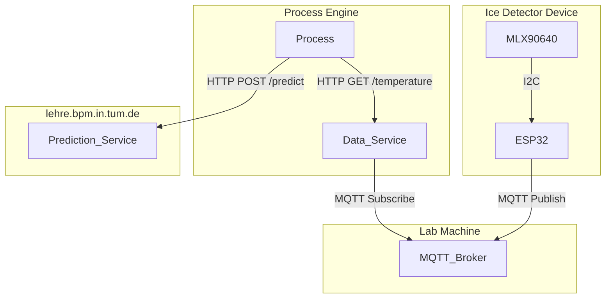

# Ice Detection System using MLX90640

This project implements an ice detection system using the **MLX90640 thermal sensor** and **ESP32 microcontroller**. The system communicates via MQTT and exposes data through an HTTP service, designed for integration in a robotic environment to ensure proper ice dispensing.

## Architecture

