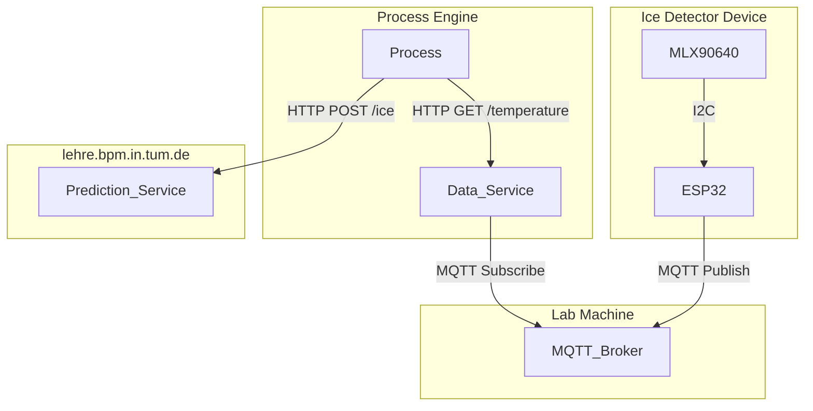

# Ice Detection System using MLX90640

This project implements an ice detection system using the **MLX90640 thermal sensor** and **ESP32 microcontroller**. The system communicates via MQTT and exposes raw thermal data through an HTTP service (Data Service). Another HTTP service (Prediction Service) is used to detect if ice is present or how much ice is present from the thermal data. A complete ice detection process is implemented using the [Cloud Process Execution Engine](https://cpee.org) and can be found [here](https://cpee.org/hub/server/Teaching.dir/Prak.dir/TUM-Prak-24-SS.dir/IceDetectorDetection.xml).

Instructions for the setup of each part can be found in their respective READMEs:
- [Ice Detector Device](https://github.com/jannemannX/master-praktikum-SoSe24/blob/main/ice-detector/README.md)
- [Data Service](https://github.com/jannemannX/master-praktikum-SoSe24/blob/main/data-service/README.md)
- [Prediction Service](https://github.com/jannemannX/master-praktikum-SoSe24/blob/main/data-service/README.md)

## Process
For demonstration purposes we implemented a process that utilizes both the data service as well as the prediction service to add error detection and handling to the already existing ice dispension process.

TODO link the process (and subprocesses)

TODO insert a screenshot of the process

TODO insert GIF of working process

## Architecture

## Challenges

TODO

## Future Work

TODO tell about potential other uses of the camera and potential improvements that could be made
