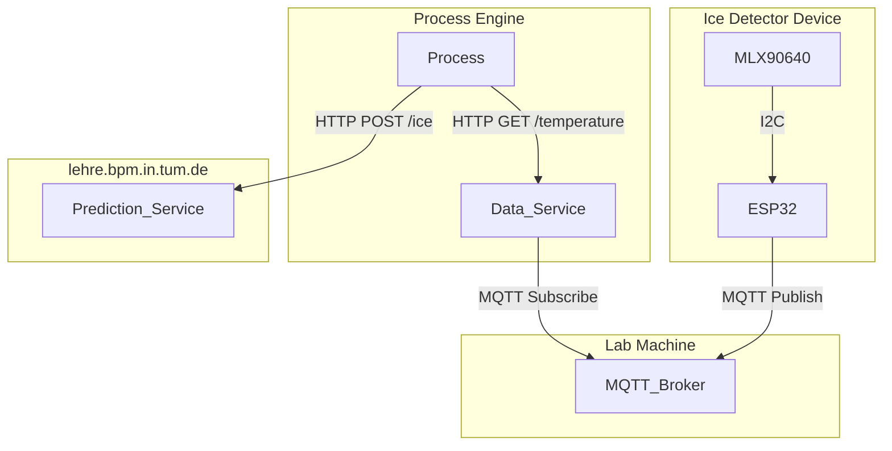

# Ice Detection System using MLX90640

This project implements an ice detection system using the **MLX90640 thermal sensor** and **ESP32 microcontroller**. The system communicates via MQTT and exposes raw thermal data through an HTTP service. Another HTTP service is used to detect if ice is present or how much ice is present from the thermal data. The complete ice detection process is implemented with the [Cloud Process Execution Engine](https://cpee.org).

READMEs for each part of the system can be found in their respective folder. The complete system was tested in October 2024.

## Process
For demonstration purposes we implemented a process that utilizes both the data service as well as the prediction service to add error detection and handling to the already existing ice dispension process.

TODO insert GIF of working process

## Architecture

