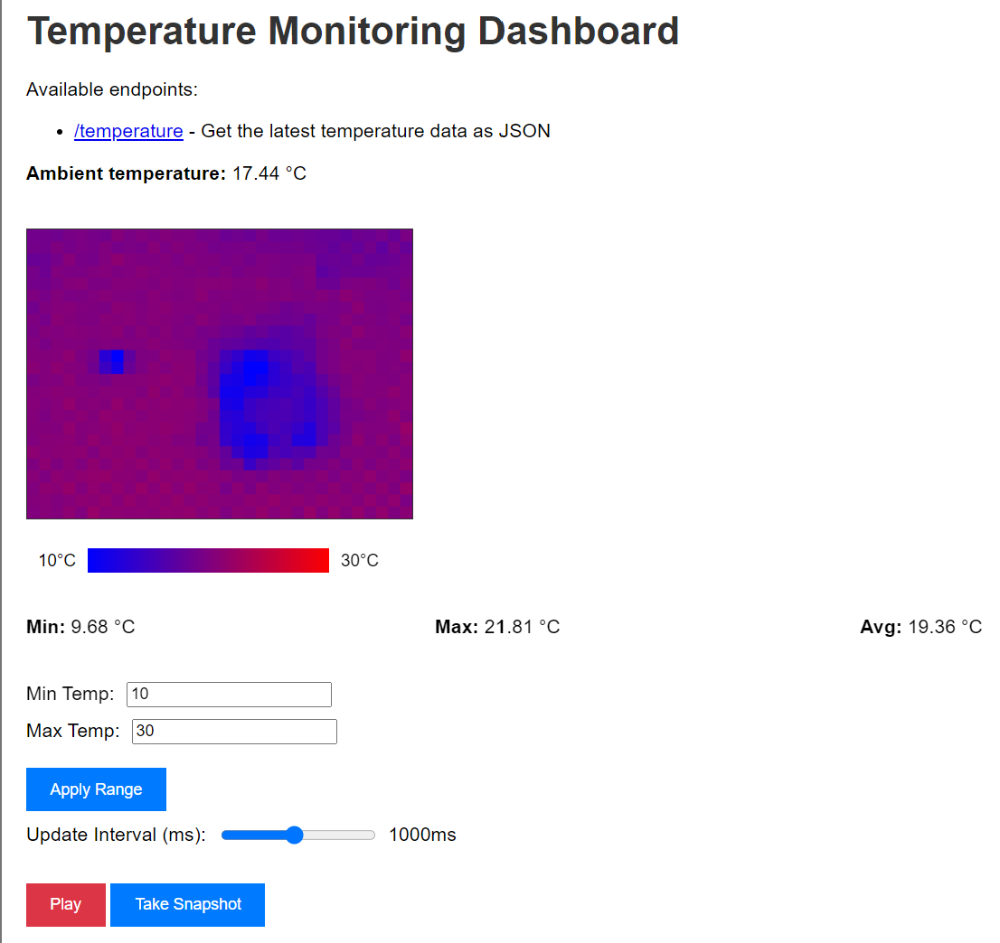

# Temperature Data Service

A microservice that collects temperature data from MQTT topics and provides it via a web API. It subscribes to ambient temperature and a grid of temperature readings topics, making this data available in JSON format and visualizing it via web dashboard.

## Deployment

1. Install dependencies:
   ```
   pip3 install -r requirements.txt
   ```

2. Set up environment:
   - Copy `.env.example` to `.env`
   - Configure these values:
     - MQTT_BROKER_IP: Your MQTT broker's IP address
     - MQTT_BROKER_PORT: Your MQTT broker's port
     - SERVICE_PORT: Port for this web service

3. Run the server:
   ```
   python3 data-service.py
   ```

## API Endpoints

### GET /temperature
Returns the current temperature readings in JSON format.

Response example (in reality the grid is 32x24):
```json
{
    "ambient_temp": 20.5,
    "grid": [
        ["19.5", "20.1", "18.9"],
        ["20.3", "19.8", "19.2"],
        ["19.7", "20.0", "19.4"]
    ]
}
```

### GET /
Serves the temperature monitoring dashboard which displays real-time sensor data with a color-coded heatmap. It shows the ambient temperature, minimum, maximum, and average temperatures, with adjustable temperature range and update interval. 



## MQTT Topics

The service subscribes to these MQTT topics:
- `ice_detector/ambient_temp`: Ambient temperature value
- `ice_detector/temperature_grid/row#`: Temperature grid readings