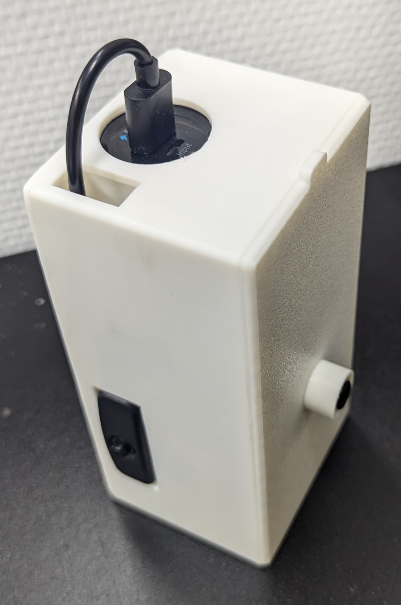

# Setup Guide
A DIY thermal imaging system that detects ice formation using an MLX90640 thermal camera and ESP32 microcontroller. The device continuously monitors surface temperatures and transmits data via MQTT for real-time ice detection. It is powered by a power bank and can be turned on and off using a physical button.

## Hardware Requirements
- ESP32 Development Board (e.g., ESP32-WROOM-32)
- MLX90640 Thermal Array
- Breakout Board for MLX90640 (EVB)
- [Anker PowerCore 5000mAh](https://www.amazon.de/dp/B01CU1EC6Y)
- [USB-Cable with power button](https://www.amazon.de/dp/B0C9PQGHGT)
- [Small flexible micro USB cable](https://www.amazon.de/dp/B071K8SW9P)
- 3D Printed Enclosure (see setup step 10)
- Jumper cables
- Recommended: Non-conductive tape



## Steps

1. **Install the Arduino IDE**

   - Download and install the latest version of the Arduino IDE from the [official Arduino website](https://www.arduino.cc/en/software).

2. **Add the ESP32 Board Manager URL**

   - Open the Arduino IDE.
   - Go to **`File` > `Preferences`**.
   - In the **"Additional Boards Manager URLs"** field, enter:

     ```
     https://raw.githubusercontent.com/espressif/arduino-esp32/gh-pages/package_esp32_index.json
     ```


3. **Install the ESP32 Board Package**

   - Go to **`Tools` > `Board` > `Boards Manager`**.
   - In the search bar, type **`esp32`**.
   - Locate **"esp32 by Espressif Systems"** and click **`Install`**.

4. **Install USB Driver (if necessary)**

   - If your ESP32 board is not showing up install the driver from Silicon Labs.
   - **Download the driver here**: [Silicon Labs CP210x USB to UART Bridge VCP Drivers](https://www.silabs.com/developers/usb-to-uart-bridge-vcp-drivers).
   - Follow the installation instructions for your operating system.

5. **Select the ESP32 Board and Port**
   - In the Arduino IDE, go to Tools > Board, and select ESP32 Dev Module.
   - Go to Tools > Port, and select the port that your ESP32 is connected to.

6. **Install Required Libraries**

   - **PubSubClient Library**
     - Go to **`Sketch` > `Include Library` > `Manage Libraries`**.
     - Search for **`PubSubClient`**.
     - Install **"PubSubClient by Nick O'Leary"**.
   - **Adafruit MLX90640 Library**
     - Still in the Library Manager, search for **`Adafruit MLX90640`**.
     - Install **"Adafruit MLX90640 by Adafruit"**.
     - Install any prompted dependencies (e.g., **Adafruit BusIO**).

7. **Configure Credentials**

   - Open the `ice-detector.ino` sketch.
   - Fill in your Wi-Fi SSID, password, and MQTT server details:

     ```cpp
     const char* ssid = "YOUR_WIFI_SSID";
     const char* password = "YOUR_WIFI_PASSWORD";
     const char* mqtt_server = "YOUR_MQTT_SERVER_IP";
     ```
8. **Upload the Sketch**

   - Click the **`Upload`** button in the Arduino IDE.
   - Press and hold the boot button on the ESP32 board when the "Connecting" message appears.
   - You should be able to see output on the Serial Monitor (115200 baud rate) after the upload is complete.

9. **Connect cables**
   - Connect the MLX90640 breakout to the ESP32 (Look for the notch on the sensor and align it with the drawing on the breakout board)
   - Follow the instructions in the PDF file [PMOD_MLX90640_DS_dt.pdf](https://github.com/jannemannX/master-praktikum-SoSe24/edit/main/ice-detector/PMOD_MLX90640_DS_dt.pdf) to connect the breakout to the ESP32.
   - Connect the rest as shown below


10.   **Print and assemble the enclosure**
   - Print the parts from the [3d_print folder](https://github.com/jannemannX/master-praktikum-SoSe24/edit/main/ice-detector/3d_print) or [Onshape](https://cad.onshape.com/documents/61ff36c19d567fb2cb1f912e/w/94b71816ca017b0d6549149e/e/821ef7029f7086ceb7cd349b?renderMode=0&uiState=671ccaab0768610ca459d367)
   - Glue the camera protection onto the lid
   - Assemble the enclosure as shown below (Use tape to fix the sensor, powerbank and button)
   - Optional: use a small esp case for better protection


